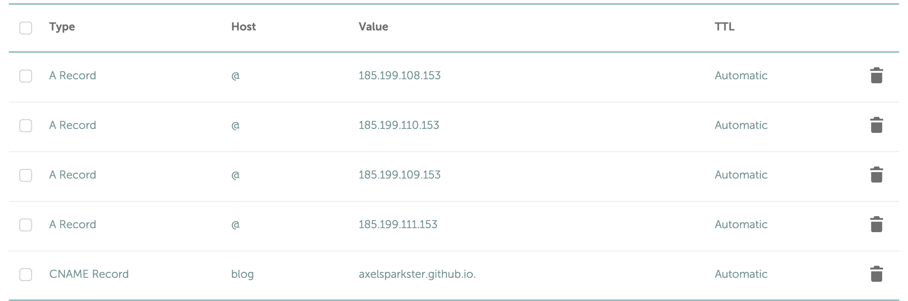

# Preface

Officially, this is my first post on this blog! So, this is a little exciting. But that's not why we're here, right? Let's get to the real content here. If you're looking for the quick fix, just shoot down to the [tl;dr section](#the-fix-tldr).

# Context

As of the time I'm creating this post - I'm what I consider pretty much a beginner to web development. I went to ng-conf](https://www.ng-conf.org) in beautiful Salt Lake City in 2019, but other than that, it's really been mostly self learning since my job only primarily works with C#.NET and Visual Basic. To get myself familiar with web technologies, I've been making a personal website that I'm coding in Angular while also having a development blog in Jekyll on the side (this one).

Originally, I wanted to have these both be in the same repository, with the main Angular website being hosted at [shootinginto.space](shootinginto.space) and the Jekyll blog being hosted in a subdirectory at [shootinginto.space/blog](shootinginto.space/blog) (don't try clicking on that - it doesn't exist!), but that presented some way more issues and more trouble than it was worth. So, instead, I followed the advice of some comments here and there and ended up making two GitHub repositories - one for the actual website, and one for the Jekyll blog.

Unfortunately, this meant that having the blog being a subdirectory of the domain wasn't really a possibility (as two sites on Github Pages cannot share the same domain name). So, instead, I went for the subdomain approach, where I would have [shootinginto.space](shootinginto.space) and [blog.shootinginto.space](blog.shootinginto.space).

While setting up both repositories, I had some issues getting the domains to wire up correctly even though I had done a bit of extensive research. There wasn't really much mentions of using apex domains (no "www") *and* subdomains with the same domain. I had tried monkeying around and fiddling with the CNAME and A records to try to get the results I wanted - my apex domain was working just great with [the documentation GitHub provided](https://docs.github.com/en/github/working-with-github-pages/about-custom-domains-and-github-pages#using-an-apex-domain-for-your-github-pages-site). The documentation for [adding a subdomain](https://docs.github.com/en/github/working-with-github-pages/managing-a-custom-domain-for-your-github-pages-site#configuring-a-subdomain) was pretty good too, but even after making these changes, my subdomain still didn't seem to work as intended. I noticed that setting up the A records for my subdomain exactly like my apex domain worked (with four A records pointing to GitHub Page's IP addresses), but not the CNAME record.

I did some more poking into GitHub Pages' documentation and [found this](https://docs.github.com/en/github/working-with-github-pages/troubleshooting-custom-domains-and-github-pages#custom-domain-names-that-are-unsupported):

```markdown
Make sure your site does not:

- Use more than one apex domain.
For example, both example.com and anotherexample.com.

- Use more than one www subdomain.
For example, both www.example.com and www.anotherexample.com.

- Use both an apex domain and custom subdomain.
For example, both example.com and docs.example.com.
```

After reading the last bullet point, I was thinking, "Ugh, crap. Is this really not possible?" I was almost to the point where I would just keep the A records pointing at my subdomain and just forget about the CNAME record and just let GitHub annoy me with the yellow error saying that I shouldn't be using A records for a subdomain. But, I decided to try one last time the following afternoon - I was in the office, and I decided to remove the A records for the subdomain and add back the CNAME record. I got a little bit carried away with my daily tasks, and about maybe half an hour later, I was like, "Wait, I still need to see if it works." So I navigated to my subdomain... and it __**worked**__.

That was all it took - all I had to do was just wait a little longer.

So... looks like GitHub's documentation isn't exactly correct. An apex domain and custom subdomain *are* allowed. You just need to set it up correctly, and most importantly, just be patient.

For the exact fixes, read the next section.

# The Fix (tl;dr)

- Create a CNAME file in the root directory of your project using your **apex domain** with __only the apex domain__. In my case, the CNAME for my apex domain only has **shootinginto.space** in it. See [here](https://github.com/AxelSparkster/shootingintospace.github.io/blob/gh-pages/CNAME).
    - **NOTE:** To make this easier, GitHub can create this file and automatically commits it for you. Just open your repository, go to Settings -> Github Pages -> Custom Domain, enter your domain in the field and click "Save".
- Create a CNAME file in the root directory of your *other* project using your **subdomain** with the __complete subdomain__. In my case, the CNAME for my blog has **blog.shootinginto.space** in it. See [here](https://github.com/AxelSparkster/spaceblog.github.io/blob/gh-pages/CNAME).
- On your domain name provider's site, set up your **apex domain** with the [IP addresses for Github Pages](https://docs.github.com/en/github/working-with-github-pages/managing-a-custom-domain-for-your-github-pages-site#configuring-an-apex-domain). (You can verify that they're the correct addresses by following the link.)
    - **NOTE:** If you don't know how to do this, for each of these records, create an A record, HOST value of @, and VALUE value of the IP address. Note this may differ between domain name providers - I personally used Namecheap.

```markdown
185.199.108.153
185.199.109.153
185.199.110.153
185.199.111.153
```

- Set up your subdomain by adding a CNAME entry with "www" as the host value (yes, just www, not your subdomain prefix) and "<username>.github.io." with the value (put in your account's username - the end period is important!)
- The most important part - **wait**. While most A record changes can be instantaneous, the CNAME records (for me, at least) took much longer to propagate.

Here's a screenshot of my records, just as a reference:



If you have any questions of comments, feel free to add a comment, and I'll try to help to the best of my ability.
